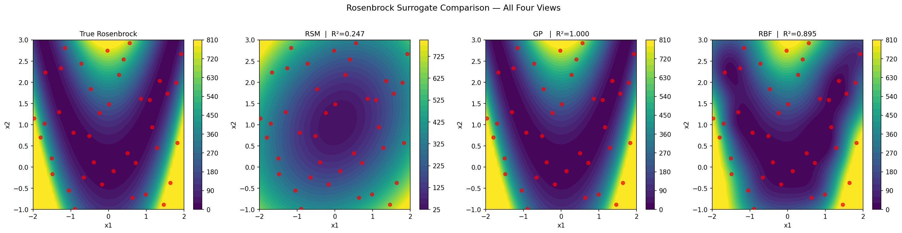

# Surrogate Model Learning

[Portfolio](https://triasha72.github.io/Portfolio/)

[](https://github.com/triasha72/Surrogate-model-learning/actions/workflows/notebooks.yml)

Learning surrogate modeling from scratch — starting with
the basics and working toward real engineering applications.

## Real measured-data benchmark

The primary evidence track now uses the UCI Airfoil Self-Noise dataset: 1,503
measurements from aerodynamic and acoustic wind-tunnel experiments (CC BY 4.0,
DOI `10.24432/C5VW2C`). Polynomial ridge, Gaussian-process, and radial-basis
surrogates are selected on validation data and evaluated once on held-out test
data. Splits are grouped by angle of attack, chord length, and free-stream
velocity so one experimental condition cannot leak across partitions.

The Branin, Rosenbrock, and analytical beam notebooks remain teaching
demonstrations; their metrics are not presented as real-world model evidence.

A second external-validation track uses the CC BY 4.0 UCI Energy Efficiency
dataset (DOI `10.24432/C51307`). It predicts measured heating and cooling loads
for 768 building configurations. All orientations of a physical design remain
in one partition, preventing design variants from leaking across train and
test. The selected model and held-out results are tracked in
`results/energy_efficiency_v1.json`; this provides a separate application
domain, not evidence that either surrogate generalizes universally.

Extra Trees was selected on validation data. On the 116-row grouped holdout it
reached heating-load R² `0.9630` (RMSE `1.8682`) and cooling-load R² `0.9330`
(RMSE `2.4359`). Reproduce from the official `ENB2012_data.xlsx` download with:

```bash
python scripts/train_energy_efficiency_real_data.py \
  --data data/external/ENB2012_data.xlsx
```

```bash
python scripts/train_airfoil_real_data.py \
  --data data/external/airfoil_self_noise.csv
```

The text-free, checksummed result is committed at
`results/airfoil_real_data_v1.json`.

The Gaussian process was selected on validation data (`R² = 0.8704`) and
achieved held-out test `R² = 0.8145`, RMSE `2.8115 dB`, and MAE `1.9079 dB` on
217 measurements. These results are materially lower than the near-perfect
analytic-function scores and are the repository's more credible evidence.

A 10-seed grouped robustness study produced mean R² `0.8662` with standard
deviation `0.0680` and an empirical 95% split-sensitivity interval from `0.7346`
to `0.9406`. Mean RMSE was `2.4818 dB`. This wide range is reported explicitly:
performance depends materially on which experimental operating conditions are
held out. The full per-seed record is in `results/airfoil_robustness_v1.json`.

The idea behind all of this: engineering and environmental
simulations are expensive. A single CFD run or 3D hydrodynamic
flood scenario can take hours to days at operational scale.
Surrogate models let you run a carefully chosen set of those
simulations, fit a cheap mathematical approximation, and then
use that approximation for everything else — optimization,
uncertainty analysis, large-scale scenario exploration. This
repo is me figuring out how to build those approximations
properly.

## What's in here

### Project 1 : GP Surrogate for the Branin Function
`notebooks/01_gp_surrogate_branin.ipynb`
[`notebooks/README_project1.md`](notebooks/README_project1.md)

The Branin function is a standard 2D benchmark that looks
like a hilly landscape. I used it as a stand-in for an
expensive simulation, sampled it at 20 carefully chosen
points using Latin Hypercube Sampling, trained a Gaussian
Process on those results, and asked it to predict everywhere
else.

**Result: R² = 0.9553 from 20 training points**

The most interesting part wasn't the accuracy number, it
was the uncertainty map. The GP correctly identified the
corners of the design space as its weakest predictions,
exactly where there was no training data. That's the GP
telling you where to run your next simulation.


### Project 2 : Cantilever Beam Deflection Surrogate
`notebooks/02_beam_deflection_surrogate.ipynb`
[`notebooks/README_project2.md`](notebooks/README_project2.md)

First real engineering application. A cantilever beam's
tip deflection depends on four variables: applied force,
beam length, Young's modulus, and second moment of area.
I treated the analytical formula as an expensive FEA solver
and built a GP surrogate to replace it.

First attempt with 30 samples gave R² = 0.64 and 19%
average error. Not good enough. The error plot showed the
surrogate was struggling hardest at small deflection values
which is a classic sign of sparse coverage in a 4D space.

Two fixes: bumped samples to 80, and log-transformed the
inputs that span orders of magnitude (E and I). That second
fix turned out to matter more than the first.

**Result: R² = 1.0 | MAPE = 0.26% from 80 training points**

The lesson here was that feature engineering matters more
than model choice. The GP didn't change at all, it is just how
the data was fed to it.


### Project 3 : Surrogate Method Comparison
`notebooks/03_surrogate_comparison.ipynb`
[`notebooks/README_project3.md`](notebooks/README_project3.md)

Same dataset, three different surrogate methods head to
head on the Rosenbrock function which is a nonlinear benchmark
with a curved valley that's easy to find but hard to follow.

| Method | R² | MAPE | Train Time |
|--------|-----|------|------------|
| RSM | 0.247 | 1763% | 0.004s |
| GP | 1.000 | 0.55% | 0.146s |
| RBF | 0.895 | 187% | 0.002s |

RSM failed completely as a degree-2 polynomial can't
represent a curved valley. RBF got the shape roughly right
but struggled at the edges. GP has the perfect value, which means we need to add some noise to it.

The takeaway: for nonlinear problems with limited data,
GP is worth the extra training time. RSM only makes sense
when you have strong reason to believe the response is
nearly quadratic. RBF sits in the middle that is, fast and decent,
but no uncertainty estimates.

The practical implication: for high-stakes scenario analysis —
flood inundation mapping, climate risk propagation, any setting
where each simulation run is expensive and data is limited —
GP's built-in uncertainty estimates make it the right default.



## What the comparison established

Together, the studies show why surrogate choice depends on the problem rather
than a single leaderboard. Gaussian processes were useful when smooth
interpolation and uncertainty mattered, polynomial models provided an
interpretable engineering approximation for beam deflection, and the comparison
notebook exposed how model complexity changed error and fitting cost under the
same data split. The reported results apply to these controlled datasets and do
not establish robustness to noisy, sparse, or extrapolative inputs.

## Tools

Python · NumPy · scikit-learn · pyDOE2 · SciPy · Matplotlib · Jupyter

## How to run
```bash
pip install -r requirements.txt
jupyter notebook
```

Every notebook is also executed from a clean kernel in GitHub Actions. This
checks that the committed studies can be reproduced with the pinned dependency
versions instead of relying on variables left in an interactive session.

## Notebooks

| Notebook | Topic | Key Result |
|----------|-------|------------|
| `01_gp_surrogate_branin.ipynb` | GP surrogate, 2D benchmark | R² = 0.9553 |
| `02_beam_deflection_surrogate.ipynb` | Beam deflection, 4D engineering problem | R² = 1.0 |
| `03_surrogate_comparison.ipynb` | RSM vs GP vs RBF comparison | GP wins under the current benchmark |
