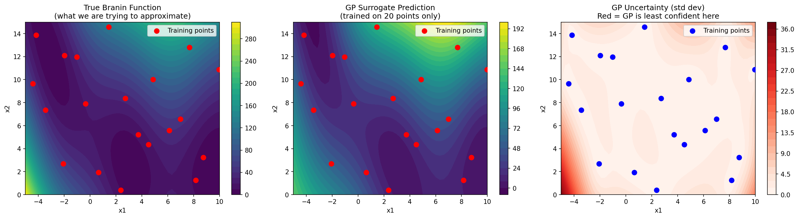
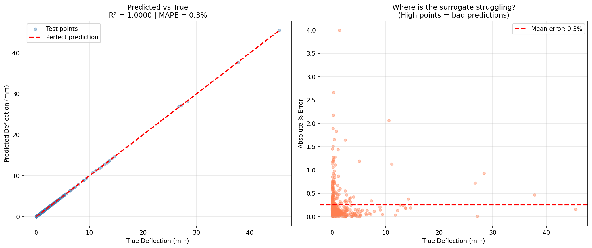

# Surrogate Model Learning

Learning surrogate modeling from scratch — starting with 
the basics and working toward real engineering applications.

The idea behind all of this: engineering simulations are 
expensive. A single CFD run can take hours. Surrogate models 
let you run a handful of those simulations, fit a cheap 
mathematical approximation, and then use that approximation 
for everything else — optimization, uncertainty analysis, 
design exploration. This repo is me figuring out how to 
build those approximations properly.

---

## What's in here

### Project 1 — GP Surrogate for the Branin Function
`notebooks/01_gp_surrogate_branin.ipynb`

The Branin function is a standard 2D benchmark that looks 
like a hilly landscape. I used it as a stand-in for an 
expensive simulation — sampled it at 20 carefully chosen 
points using Latin Hypercube Sampling, trained a Gaussian 
Process on those results, and asked it to predict everywhere 
else.

**Result: R² = 0.91 from 20 training points**

The most interesting part wasn't the accuracy number — it 
was the uncertainty map. The GP correctly identified the 
corners of the design space as its weakest predictions, 
exactly where there was no training data. That's the GP 
telling you where to run your next simulation.



---

### Project 2 — Beam Deflection Surrogate
`notebooks/02_beam_deflection_surrogate.ipynb`

First real engineering application. A cantilever beam's 
tip deflection depends on four variables: applied force, 
beam length, Young's modulus, and second moment of area. 
I treated the analytical formula as an expensive FEA solver 
and built a GP surrogate to replace it.

First attempt with 30 samples gave R² = 0.64 and 19% 
average error. Not good enough. The error plot showed the 
surrogate was struggling hardest at small deflection values 
— a classic sign of sparse coverage in a 4D space.

Two fixes: bumped samples to 80, and log-transformed the 
inputs that span orders of magnitude (E and I). That second 
fix turned out to matter more than the first.

**Result: R² = 1.0 | MAPE = 0.26% from 80 training points**

The lesson here was that feature engineering matters more 
than model choice. The GP didn't change at all — just how 
the data was fed to it.



---

## Tools

Python · NumPy · scikit-learn · pyDOE2 · Matplotlib · Jupyter

## How to run
```bash
pip install -r requirements.txt
jupyter notebook
```

## What's coming next

- Project 3: comparing surrogate methods side by side 
  (Response Surface vs GP vs RBF)
- Project 4: surrogate-based airfoil optimization
- Project 5: active learning — letting the GP decide 
  where to sample next