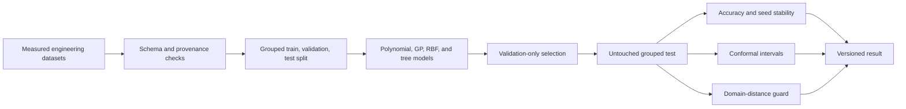

# System architecture

Grouping keeps related physical configurations in one partition. Model choice
and interval calibration use training and validation data; the test split is
opened once for the frozen comparison. Analytical functions remain teaching
examples and are reported separately from measured-data results.

A deployed version would add dataset-drift monitoring and a retraining policy.
The current package focuses on honest offline evidence and on refusing
extrapolation when a new design is too far from the training domain.
